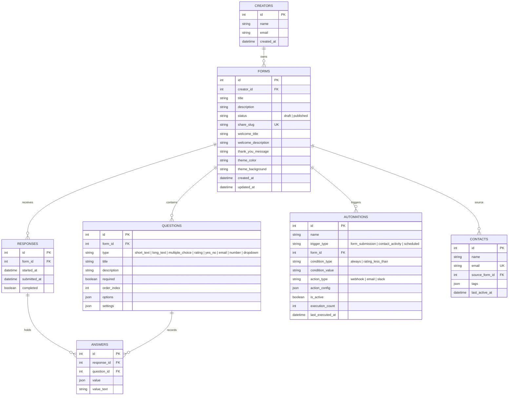

# Formix — Conversational Form Builder & Intelligence Platform

[](https://nextjs.org/)
[](https://www.typescript.org/)
[](https://fastapi.tiangolo.com/)
[](https://www.python.org/)
[](https://tailwindcss.com/)

**Formix** is a high-fidelity, production-grade Typeform replica and conversational form intelligence ecosystem. It features a drag-and-drop form builder, an animated one-question-at-a-time respondent flow, quantitative analytics, CSV exports, an **Ask Formix AI** natural language assistant, an **Automations Engine** with live webhooks, and an auto-synced **Contacts Hub**.

---

## 🔗 Quick Links & Submission Links

* **GitHub Repository:** [https://github.com/DharunSA/Formix.git](https://github.com/DharunSA/Formix.git)
* **Live Web Application (Vercel):** [https://formix.vercel.app](https://formix.vercel.app) *(Deploy instructions below)*
* **Backend API Documentation:** [http://localhost:8000/docs](http://localhost:8000/docs) (Swagger UI)

---

## 🛠️ Tech Stack & Key Libraries

| Layer | Technologies & Libraries |
|---|---|
| **Frontend** | Next.js 16 (App Router, React 19, TypeScript), Tailwind CSS v4, Framer Motion, `@dnd-kit` (drag-and-drop), TanStack Query (v5), Lucide/Material Icons, Sonner (toasts) |
| **Backend** | Python 3.12, FastAPI, SQLAlchemy 2.0 (ORM), Pydantic v2, Uvicorn |
| **Database** | SQLite (file-based local DB in `backend/typeform.db`) / PostgreSQL (production-ready via `psycopg2-binary`) |
| **Styling & Design System** | Custom Obsidian & Ivory theme palette, glassmorphism, responsive micro-animations, light/dark mode support, Playfair Display & Plus Jakarta Sans typography |

---

## 📁 Repository Structure

```text
Formix/
├── backend/                  # FastAPI Application
│   ├── app/
│   │   ├── main.py           # App entrypoint, CORS configuration, router imports
│   │   ├── database.py       # SQLAlchemy engine & session factory
│   │   ├── models.py         # SQLAlchemy ORM schemas (Form, Question, Response, Answer, Contact, Automation)
│   │   ├── schemas.py        # Pydantic request/response validation models
│   │   ├── validation.py     # Server-side per-question answer validation
│   │   ├── deps.py           # Database dependencies & default creator provider
│   │   ├── seed.py           # Automatic data seeder (forms, questions, responses, contacts, automations)
│   │   └── routers/
│   │       ├── forms.py      # Form CRUD, question management, publish/unpublish, summary stats, CSV export
│   │       ├── public.py     # Public form rendering & response submission API
│   │       ├── contacts.py   # Contacts Hub CRUD, search, tags & auto-sync from forms
│   │       ├── automations.py# Automations engine: trigger cards, action nodes, test execution
│   │       └── ai.py         # Ask Formix AI form generator & natural language response insights
│   ├── requirements.txt      # Python dependencies (FastAPI, SQLAlchemy, psycopg2-binary, Uvicorn)
│   └── render.yaml           # Deployment blueprint for Render.com
│
└── frontend/                 # Next.js 16 Application
    ├── src/
    │   ├── app/              # Next.js App Router pages
    │   │   ├── (landing)/    # Obsidian & Ivory landing page, login, signup routes
    │   │   ├── dashboard/    # Workspace forms grid/list view with filters and search
    │   │   ├── contacts/     # Contacts Hub & CRM sync dashboard
    │   │   ├── automations/  # Automations engine & visual builder modal
    │   │   ├── forms/[id]/   # Form builder (`/edit`), preview (`/preview`), results (`/results`)
    │   │   └── f/[slug]/     # Public respondent flow route
    │   ├── components/       # Modular UI components
    │   │   ├── ai/           # AskFormixAICapsule & AIInsightsModal
    │   │   ├── builder/      # Drag-and-drop question cards, live preview panel, settings modal
    │   │   ├── dashboard/    # Form cards, workspace top nav, workspace sidebar
    │   │   ├── landing/      # LandingNav, HeroSection, FeaturesSection, IntegrationsSection
    │   │   ├── respondent/   # One-question-at-a-time slide flow & keyboard shortcuts
    │   │   ├── results/      # Analytics stat cards, charts, response detail modal, AI insights
    │   │   ├── ui/           # Buttons, Modals, Badges, ConfirmDialog, ThemeToggle
    │   │   └── workspace/    # IntegrationsModal, BrandKitModal, ViewPlansModal, HelpCenterModal
    │   └── lib/              # API client (`api.ts`), TypeScript types (`types.ts`), validation rules
    ├── vercel.json           # Vercel deployment configuration
    └── package.json          # Node.js dependencies
```

---

## ⚡ Setup Instructions (Local Development)

### Prerequisites
- **Node.js**: v20.0.0 or higher
- **Python**: v3.12.0 or higher
- **Git**: Installed

### Step 1: Clone Repository
```bash
git clone https://github.com/DharunSA/Formix.git
cd Formix
```

### Step 2: Backend Setup
```bash
cd backend

# Create virtual environment
python -m venv venv

# Activate virtual environment
# Windows (PowerShell):
.\venv\Scripts\Activate.ps1
# macOS/Linux:
# source venv/bin/activate

# Install dependencies
pip install -r requirements.txt

# Start backend server
uvicorn app.main:app --reload --port 8000
```
> 💡 *On initial startup, the backend automatically seeds `backend/typeform.db` with sample forms, respondent submissions, contacts, and automation rules.*
> Interactive API documentation will be accessible at: **`http://localhost:8000/docs`**

### Step 3: Frontend Setup
```bash
# Open a new terminal in the project root
cd frontend

# Install Node dependencies
npm install

# (Optional) Verify local environment file
# .env.local contains: NEXT_PUBLIC_API_URL=http://localhost:8000

# Launch Next.js development server
npm run dev
```
> 🚀 Access the web application at: **`http://localhost:3000`**

---

## 🏛️ Architecture Overview

Formix is engineered following a decoupled, client-server client architecture:

1. **Frontend App Router Architecture (Next.js 16)**:
   - **Workspace Shell**: Shared layout for Dashboard, Contacts, and Automations tabs.
   - **Atomic Autosave Engine**: Form builder updates are debounced and saved automatically (~900ms) with negative temporary client IDs reconciled on save response.
   - **Interactive Respondent Flow**: Keyboard-driven (`Enter`, `1-9`, `↑/↓`), animated step transitions via Framer Motion, and instant client-side validation.
   - **State Management**: Server state is synchronized using **TanStack Query (v5)** with optimistic UI updates and cache invalidation.

2. **Backend API Service (FastAPI & SQLAlchemy)**:
   - RESTful API with structured response schemas (`Pydantic v2`).
   - SQLite ORM database (`SQLAlchemy 2.0`) with transactional cascade deletes and diff-and-replace updates for form questions.
   - **Server-side Answer Validation**: Validates answers authoritatively before persistence (`validation.py`).

3. **Ecosystem & AI Features**:
   - **Ask Formix AI**: Natural language prompt-to-form builder (`POST /api/ai/generate-form`) and executive response sentiment synthesis (`POST /api/ai/ask-insights`).
   - **Automations Engine**: Workflow rules supporting Form Submission triggers, condition logic, and Webhook/Email/Slack action nodes (`/api/automations`).
   - **Contacts Hub**: Centralized record of respondents automatically extracted from email question fields (`/api/contacts/auto-sync`).

---

## 🗄️ Database Schema

The SQLite/PostgreSQL relational database contains 6 core entities:



---

## 🌐 API Overview

### 1. Form Management (`/api/forms`)
| Method | Endpoint | Description |
|---|---|---|
| `GET` | `/api/forms` | List all forms with question and response count stats |
| `POST` | `/api/forms` | Create a new form |
| `GET` | `/api/forms/{id}` | Get complete form details with questions |
| `PATCH` | `/api/forms/{id}` | Update form metadata (title, theme color, background) |
| `PUT` | `/api/forms/{id}/questions` | Replace and reorder full list of questions |
| `DELETE` | `/api/forms/{id}` | Delete form (cascades to questions, responses, and answers) |
| `POST` | `/api/forms/{id}/duplicate` | Duplicate form structure as a new draft |
| `POST` | `/api/forms/{id}/publish` | Publish form (requires ≥ 1 question) |
| `POST` | `/api/forms/{id}/unpublish` | Unpublish form back to draft |

### 2. Analytics & Responses (`/api/forms/{id}`)
| Method | Endpoint | Description |
|---|---|---|
| `GET` | `/api/forms/{id}/responses` | List all respondent submissions |
| `GET` | `/api/forms/{id}/responses/{res_id}` | Get detailed individual response |
| `GET` | `/api/forms/{id}/responses/export.csv` | Download CSV file of all submissions |
| `GET` | `/api/forms/{id}/summary` | Aggregate per-question analytics & completion rate |

### 3. Public Respondent Flow (`/api/public`)
| Method | Endpoint | Description |
|---|---|---|
| `GET` | `/api/public/forms/{share_slug}` | Fetch published form payload for filling |
| `POST` | `/api/public/forms/{share_slug}/responses/progress` | Auto-save partial response progress |
| `POST` | `/api/public/forms/{share_slug}/responses` | Submit completed form answers with server validation |

### 4. Ask Formix AI (`/api/ai`)
| Method | Endpoint | Description |
|---|---|---|
| `POST` | `/api/ai/generate-form` | Generate complete form structure from natural language prompt |
| `POST` | `/api/ai/ask-insights` | Synthesize qualitative respondent feedback into executive AI insights |

### 5. Automations & Contacts (`/api/automations` & `/api/contacts`)
| Method | Endpoint | Description |
|---|---|---|
| `GET` | `/api/automations` | List active automation rules |
| `POST` | `/api/automations` | Create visual automation workflow rule |
| `POST` | `/api/automations/{id}/test` | Trigger live test webhook payload |
| `GET` | `/api/contacts` | List contacts hub records with search and filters |
| `POST` | `/api/contacts/auto-sync` | Auto-extract email respondents into Contacts Hub |

---

## 🚀 Cloud Deployment Guide

### Option A: Frontend Deployment (Vercel)
1. Push repository to GitHub.
2. Sign in to [Vercel](https://vercel.com/) and click **Add New Project**.
3. Select `Formix` repository, set **Root Directory** to `frontend`.
4. Add Environment Variable:
   - `NEXT_PUBLIC_API_URL`: `https://formix-api.onrender.com` (or your hosted backend URL)
5. Click **Deploy**. Vercel auto-detects `vercel.json` and builds the Next.js application.

### Option B: Backend Deployment (Render.com)
1. Sign in to [Render](https://render.com/) and click **New → Blueprint**.
2. Connect your GitHub repository `DharunSA/Formix`.
3. Render automatically reads `backend/render.yaml` and provisions the Python web service.
4. Set Environment Variable:
   - `ALLOWED_ORIGINS`: `https://formix.vercel.app` (your Vercel frontend URL)
5. Click **Apply**. The backend API will be live with Swagger documentation.

---

## 📄 License
This project is open-source under the MIT License. Developed for technical evaluation and assignment purposes.
